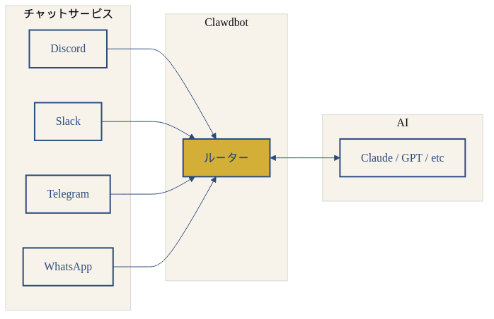
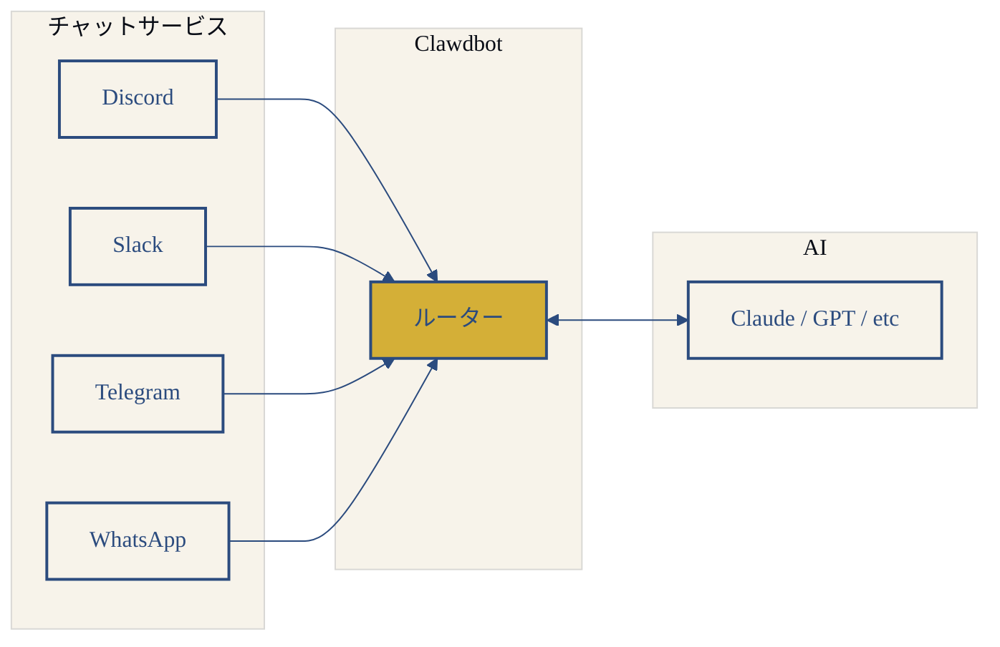
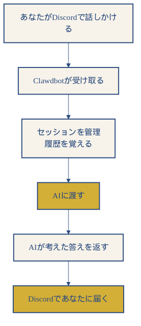
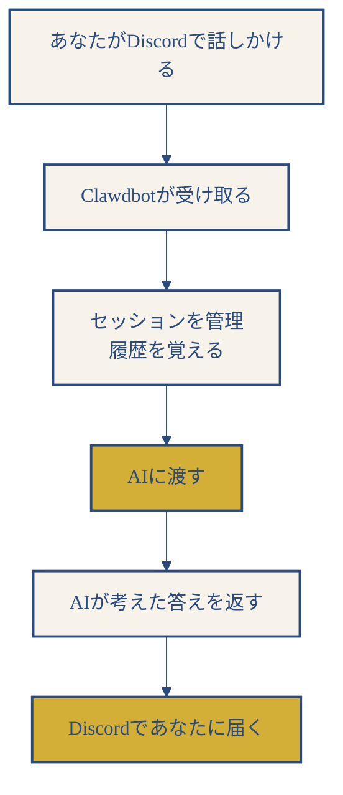
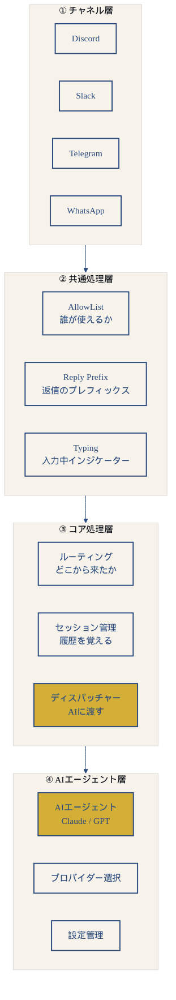
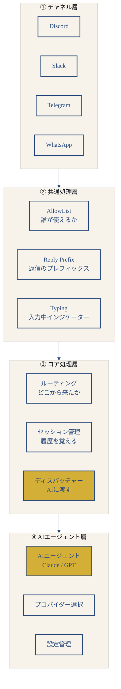
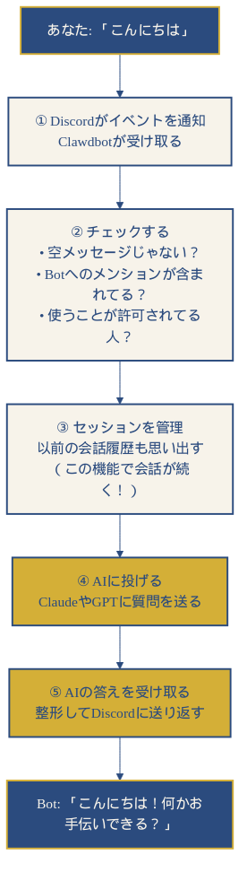
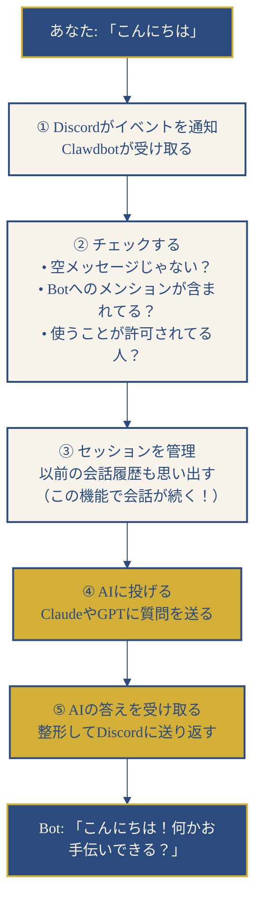
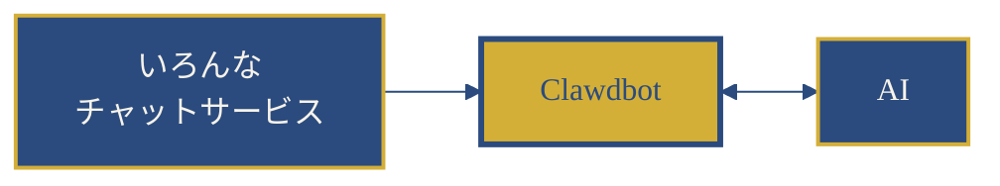

# Clawdbot って何？

……ふふ、まずは全体像から見ていこうか。

## ざっくり言うと

**Clawdbot = 複数のチャットサービスとAIを繋ぐ架け橋**





## メッセージがどう動いてるか





## 中身は4つに分かれてる





## Discordで話しかけるとどうなる？





## 主な機能

| 機能 | 説明 |
|------|------|
| **マルチャネル対応** | Discord、Slack、Telegram、WhatsAppなど |
| **セッション管理** | 会話の履歴を覚えてくれる |
| **AIプロバイダ切り替え** | Claude、GPT、ローカルモデルなど選べる |
| **メディア対応** | 画像やファイルも送れる |
| **AllowList** | 誰がBotを使えるか制御できる |
| **スレッド対応** | Discordスレッドでも会話できる |

## ファイルの場所（ざっくり）

```
clawdbot/src/
├── discord/      # Discordとの連携部分
│   └── monitor/
│       ├── provider.ts              # Discordプロバイダのメイン
│       ├── message-handler.process.ts   # メッセージ処理
│       └── message-handler.preflight.ts # 事前チェック
├── slack/        # Slackとの連携部分
├── channels/     # どのチャネルでも使う共通処理
│   └── session.ts                   # セッション管理
├── routing/      # 「どのAIに渡すか」を判断するルーター
│   └── resolve-route.ts             # ルーティング決定
├── agents/       # AIエージェントの実行部分
│   ├── pi-embedded-runner.ts        # エージェント実行エンジン
│   └── auth-profiles.ts             # 認証プロファイル管理
├── auto-reply/   # 自動返信機能
│   └── dispatch.ts                  # ディスパッチャー
├── gateway/      # WebSocketサーバー（リアルタイム通信用）
│   ├── server.impl.ts               # Gatewayサーバーメイン
│   └── server/ws-connection.ts      # WebSocket接続
└── media/        # 画像やファイルの処理
```

## まとめ




**Clawdbotは**

「いろんなチャットサービス」と「AI」を
つなぐための便利なツール

会話の履歴を覚えてくれたり、
画像を送ったりもできる

……ふふ、そんな感じかな

---

……これなら少しわかりやすいかな？
