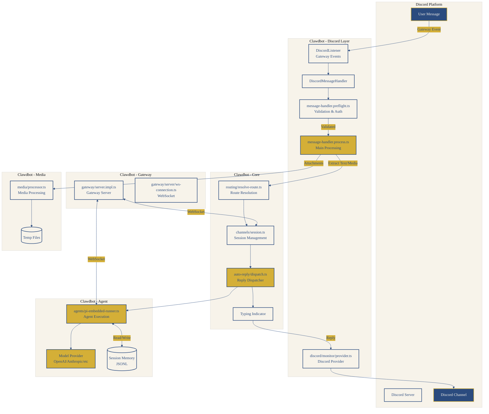
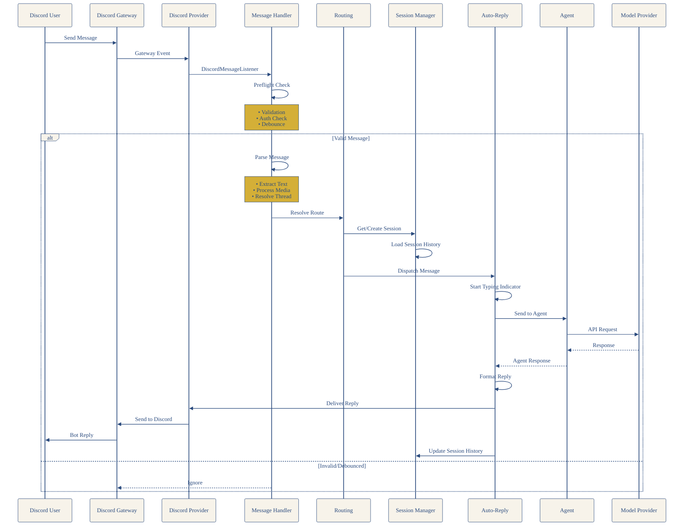
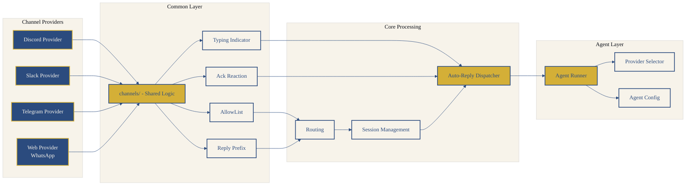

# Clawdbot アーキテクチャ

……ふふ、Clawdbotの全体像をまとめてみたよ。

## 概要

Clawdbotは、複数のメッセージングプラットフォーム（Discord、Slack、Telegram、WhatsAppなど）とAIエージェントを接続するためのフレームワークです。

## 全体アーキテクチャ




## メッセージフロー




## チャネル共通レイヤー




## ディレクトリ構造

```
clawdbot/src/
├── discord/          # Discord連携のコア
├── channels/         # チャネル共通処理
├── gateway/         # ゲートウェイサーバー
├── routing/          # ルーティング
├── agents/           # エージェント処理
├── web/             # Webプロバイダー
└── auto-reply/      # 自動返信機能
```

## 主要コンポーネント

### Discord Layer

| ファイル | 主要な関数/エクスポート | 役割 |
|---------|---------------------|------|
| `discord/monitor/provider.ts` | `monitorDiscordProvider` | Discordプロバイダのメインエントリーポイント。Discordクライアントの初期化、コマンドデプロイ、メッセージハンドラー登録 |
| `discord/monitor/message-handler.process.ts` | `processDiscordMessage` | メッセージ処理の本体。テキスト/メディアの抽出、ルーティング、セッション管理、AIへのディスパッチ |
| `discord/monitor/message-handler.preflight.ts` | `preflightDiscordMessage` | メッセージの事前チェック（認証・検証）。Botメッセージ除外、AllowListチェック、メンション検証 |

### Core Processing

| ファイル | 主要な関数/エクスポート | 役割 |
|---------|---------------------|------|
| `routing/resolve-route.ts` | `resolveAgentRoute`, `buildAgentSessionKey` | 送信元から宛先のルーティング決定。セッションキー生成、バインディング解決 |
| `channels/session.ts` | `recordInboundSession` | セッション管理と履歴保存。セッションメタデータの記録、ルート更新 |
| `auto-reply/dispatch.ts` | `dispatchInboundMessage`, `createReplyDispatcherWithTyping` | メッセージのディスパッチと返信制御。Typingインジケーター付きディスパッチャー作成 |

### Agent Layer

| ファイル | 主要な関数/エクスポート | 役割 |
|---------|---------------------|------|
| `agents/pi-embedded-runner.ts` | `runEmbeddedPiAgent` | エージェント実行エンジン。Claude Embedded Piとのやり取り、セッション管理 |
| `agents/pi-embedded-runner/run.ts` | `runEmbeddedPiAgent` (実装) | エージェント実行の実装詳細 |
| `agents/auth-profiles.ts` | 認証プロファイル管理 | AIプロバイダーの認証情報管理 |

### Gateway Layer

| ファイル | 主要な関数/エクスポート | 役割 |
|---------|---------------------|------|
| `gateway/server.impl.ts` | `startGateway` | Gatewayサーバーのメイン実装。WebSocketサーバー起動、チャネル管理 |
| `gateway/server/ws-connection.ts` | WebSocket接続管理 | WebSocket接続の確立、メッセージハンドリング |

### Common Layer

| 機能 | 役割 |
|------|------|
| AllowList | アクセス制御（誰がBotを使えるか） |
| Reply Prefix | 返信プレフィックス設定 |
| Typing Indicator | 「入力中...」インジケーター |
| Ack Reaction | 処理開始のリアクション（👍） |

## メッセージ処理の詳細

### 1. 事前チェック（Preflight）

```
discord/monitor/message-handler.preflight.ts
```

- メッセージ検証（空メッセージの除外）
- メンションチェック
- 認証・権限確認
- デバウンス処理（重複メッセージの抑制）

### 2. メッセージ解析

- テキスト抽出（リプライ含む）
- メディアアタッチメント処理
- スレッド情報解決

### 3. ルーティング決定

```typescript
// 送信元情報から宛先を決定
const effectiveFrom = isDirectMessage
  ? `discord:${author.id}`
  : `discord:channel:${message.channelId}`;
```

### 4. セッション管理

- セッションキー生成
- 履歴保存（JSONL形式）
- 既存セッションの継続/新規作成判断

### 5. エージェントへのディスパッチ

```typescript
const { dispatcher, replyOptions, markDispatchIdle } = createReplyDispatcherWithTyping({
  deliver: async (payload: ReplyPayload) => {
    // Discordへの返信処理
    await deliverDiscordReply({ /* ... */ });
  }
});
```

## 特徴的な仕組み

### デバウンス機構

- 短時間内の重複メッセージを処理を抑制
- 非同期キューでバッチ処理

### スレッド対応

- Discordスレッドの子メッセージを親セッションに関連付け
- 自動スレッド作成機能

### リアクションフィードバック

- 処理開始時のリアクション（👍）
- 処理完了後のリアクション削除

### メンション検知

- Botへのメンションの有効チェック
- 通常メッセージとコマンドメッセージの区別

## レイヤー別の役割

| レイヤー | 役割 |
|---------|------|
| **Discord Layer** | Discord Gatewayのイベント監視、メッセージ受信 |
| **Common Layer** | 全チャネル共通処理（AllowList、Typing等） |
| **Core Processing** | ルーティング、セッション管理、ディスパッチ |
| **Agent Layer** | エージェント実行、モデル呼び出し |

## 関連リンク

- [Clawdbot Repository](https://github.com/clawdbot/clawdbot)
- [Clawdbot Docs](https://docs.clawd.bot/)

---

……ふふ、これでClawdbotの全体が見えたかな。
